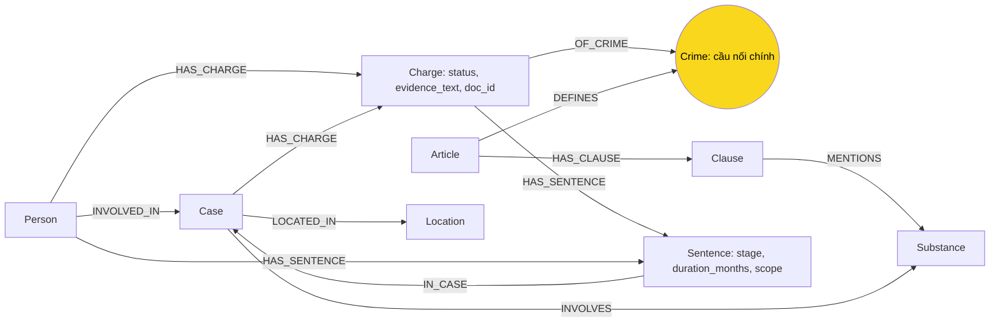

# Thiết kế Ontology — Day 19

**Họ tên:** Bùi Tiến Cường  **MSSV:** 2A202602539

- [ ] Dùng ontology gợi ý
- [x] Tự thiết kế (xét bonus +15)

**Trạng thái:** KG-1..KG-4 đã triển khai và kiểm chứng Neo4j ngày 05-10-2026. `--check` chính thức đạt 7 `[OK]`; 60 test pass (48 gốc + 12 bổ sung). Benchmark checklist cuối: 282 node / 519 cạnh, đủ 9 label, recall trung bình 1.00 và judge 2.00/2. Baseline gợi ý: 205 node / 384 cạnh, recall 0.83 và judge 1.67/2. B1 có hai Charge độc lập; Q6 trả 3 nhóm vụ có nguồn; B3 giữ withdrawn. Graph được dựng lại bằng --judge từ code cuối. REPORT_KG.md đã điền và ba ảnh đúng Q-A/Q-B/Q-D được chụp ở lượt trước (278/507); khác thời điểm ghi nhận được giải thích trong báo cáo.

**Phạm vi:** Giữ Crime làm cầu nối; thêm Charge theo người–vụ–tội với trạng thái và nguồn chứng minh; thêm Sentence với giai đoạn và thời lượng chuẩn hóa. Không thêm mô hình ngưỡng khối lượng.

## 1. Sơ đồ



Hai đường HAS_SENTENCE là hai trường hợp: Charge sở hữu án riêng theo tội, Person sở hữu án tổng hợp trong vụ. INVOLVED_IN giữ người liên quan chưa xác định tội, không còn chứa charge/sentence.

Đường truy vấn: Person → Charge → Crime ← Article → Clause. Charge tới Article có 2 cạnh, Case tới Article có 3 cạnh: cấu trúc phù hợp kiểm tra cầu nối ≤4 cạnh khi trích xuất đúng.

## 2. Entity types (node labels)

| Label | Ý nghĩa | Khóa MERGE | Properties | KB | Trích bằng |
| --- | --- | --- | --- | --- | --- |
| Article | Điều luật trong một văn bản/phiên bản | id = document_version_key + article_number | id, title, law, article_number, document_version_key, text, doc_id, source_url | Luật | Metadata + regex |
| Clause | Khoản thuộc Điều | id = article_id + clause_number | id, number, penalty, text, doc_id | Luật | Regex |
| Crime | Tội danh chuẩn dùng chung | id từ danh mục tội chuẩn của luật | id, name, aliases | Cả hai | Tiêu đề luật; LLM + link_entity cho tin |
| Case | Vụ việc trong một tài liệu | id = doc_id + case_index | id, name, summary, date, case_reference, doc_id, source_url | Tin | LLM + code tạo khóa; case_reference từ tham chiếu vụ nguyên văn khi tài liệu có đúng một Case |
| Person | Người trong một tài liệu | id = doc_id + normalized_full_name; thêm chỉ số nếu nguồn phân biệt người trùng tên | id, name, aliases, age, doc_id | Tin | LLM + code |
| Charge | Ghi nhận buộc tội/hành vi theo người, vụ, sự kiện và nguồn | id = case_id + person_id + crime_key_or_raw_key + status + event_key | id, status, raw_charge, stage, event_date, evidence_text, doc_id, source_url, link_method | Tin | LLM + kiểm tra nguồn + code |
| Sentence | Mức án được ghi nhận trong một lần xét xử | id = owner_id + stage + event_key + scope | id, scope, stage, penalty_type, duration_months, raw_text, event_date, evidence_text, doc_id, source_url | Tin | LLM xác định ngữ cảnh + code chuẩn hóa |
| Substance | Chất chuẩn dùng chung | name chuẩn | name | Cả hai | find_substances + LLM + so khớp chuẩn |
| Location | Địa điểm trong nguồn | id = doc_id + normalized_location | id, name, doc_id | Tin | LLM |

### Quy ước khóa và nguồn

- Dùng mã hóa có cấu trúc hoặc hash xác định để ghép khóa, tránh nhập nhằng. Không dùng tên vụ do LLM đặt làm khóa. case_index theo thứ tự bằng chứng trong tài liệu.
- event_key lấy từ sự kiện/ngày nguồn nêu rõ; nếu thiếu dùng khóa đoạn chứng minh đã chuẩn hóa. Không lấy ngày đăng báo làm ngày xét xử.
- Node thuộc một tài liệu có doc_id = Document.id. Crime/Substance là danh mục dùng chung; nguồn ghi nhận nằm ở Charge/Case và Article/Clause. Không ghi đè một doc_id tùy tiện lên node dùng chung.
- Person/Case định danh theo tài liệu, chưa hợp nhất liên tài liệu. aliases phục vụ tìm kiếm, không chứng minh hai người là một.
- Tầng retrieval có thể nhóm Case để trình bày, không MERGE node liên tài liệu. Cần ít nhất hai tên người chung và ngày/địa điểm sự kiện trùng, hoặc câu nguồn dài trùng, hoặc case_reference trùng. case_reference là cụm nguồn nêu số bị cáo và vụ án xảy ra tại một đơn vị; bỏ hậu tố diễn biến phiên tòa, không suy ra từ tên người/chất. Mọi doc_id vẫn được liệt kê trong mục đã nhóm; thiếu căn cứ thì giữ riêng.
- Thuộc tính chưa biết bỏ khỏi node; không tự điền. Không suy ra đã bị kết án chỉ từ việc bị bắt.

### Từ vựng và chuẩn hóa

- Charge.status: investigating, initiated, prosecuted, convicted, withdrawn, acquitted, unknown. withdrawn dùng cho ghi nhận hủy/rút quyết định theo nguồn, không tự suy ra acquitted.
- Charge.stage: investigation, prosecution, first_instance, appeal, unknown. Một Charge là ghi nhận tại một trạng thái/sự kiện; không ghi đè lịch sử bằng trạng thái mới.
- Sentence.stage: first_instance, appeal, unknown. Phiên phúc thẩm bị hoãn không tạo Sentence phúc thẩm.
- Sentence.scope: per_charge hoặc aggregate. Chỉ tạo per_charge khi nguồn gắn mức án với tội cụ thể; án tổng hợp không nhân bản vào từng Charge. Khi nguồn không xác định phạm vi, giữ raw_text trong nguồn/summary và yêu cầu kiểm tra, không ép scope.
- penalty_type: imprisonment, life_imprisonment, death, other. Chỉ imprisonment có duration_months: 36 tháng → 36; 2 năm → 24; 8 năm 6 tháng → 102. Chung thân/tử hình không gán 0 tháng hoặc số năm giả định.
- link_method: exact, fuzzy, unlinked. Tội ngoài KB vẫn giữ Charge.raw_charge và nguồn, không tự tạo Crime có căn cứ luật giả định.
- evidence_text phải là đoạn nguồn liên tiếp có thể đối chiếu sau chuẩn hóa Unicode/khoảng trắng. Không tìm thấy đoạn thì trích lại hoặc loại ghi nhận trước khi ghi graph.
- KG-2 đánh số câu nguồn và yêu cầu LLM trả evidence_ids. Code dựng evidence_text từ khoảng nguồn bao trùm các mã được chọn, giữ cả câu ở giữa khi mã không liền nhau; ID không tồn tại bị loại. LLM không cần chép lại bằng chứng. Ngày sự kiện phải là ISO hợp lệ và năm xuất hiện trong bằng chứng; quy tắc này chưa chứng minh được ngày đó thuộc đúng sự kiện.
- Validation kiểm kiểu JSON, enum, tên người có trong nguồn, liên kết mức án/trạng thái và cụm mức án nguyên văn. Có tối đa một lần trích lại; lỗi còn lại được log kèm doc_id, chỉ giữ phần hợp lệ và không cache kết quả có lỗi. Bằng chứng có thật chưa bảo đảm trích xuất đúng nghĩa hoặc đầy đủ.
- Validation phát hiện danh sách nhiều tội rõ ràng, kiểm tra các tội bị bỏ sót khi cùng bằng chứng nêu đầy đủ tên người; kiểm tra ghi nhận hủy khởi tố có đích người không nhập nhằng và chất nêu trực tiếp trong câu giám định/thu giữ khi tài liệu có một Case. Không tách mọi liên từ, không tạo dữ kiện từ gold; lỗi độ đầy đủ yêu cầu retry. Chất được kiểm bằng từ nguyên vẹn để tránh Amphetamine bị nhận nhầm trong Methamphetamine.
- KG-3 giữ evidence_text đầy đủ trong graph nhưng đưa các trích đoạn nguyên văn vào prompt, ngăn cách bằng `[…]`. Khung cơ bản lấy khoản 1; mức tối đa lấy phần mở đầu khung phạt các khoản; theo chất giữ phần mở đầu và các điểm liên quan. Bỏ cạnh hash dư và giữ nguyên vector chunks; phần graph có ngân sách 5.000 token (ước tính byte/3 nếu không có tiktoken), không bảo đảm token toàn prompt luôn dưới mốc này.

## 3. Relationships

| Type | Từ → Đến | Properties trên cạnh | Ý nghĩa |
| --- | --- | --- | --- |
| INVOLVED_IN | Person → Case | role | Người liên quan, kể cả chưa xác định buộc tội |
| HAS_CHARGE | Person → Charge | Không | Người của ghi nhận buộc tội |
| HAS_CHARGE | Case → Charge | Không | Vụ của ghi nhận buộc tội |
| OF_CRIME | Charge → Crime | Không | Tội danh chuẩn khi liên kết đủ căn cứ |
| DEFINES | Article → Crime | Không | Điều luật định nghĩa tội |
| HAS_CLAUSE | Article → Clause | Không | Điều chứa khoản |
| MENTIONS | Clause → Substance | Không | Khoản nhắc chất |
| INVOLVES | Case → Substance | amount, evidence_text, doc_id | Chất/khối lượng nguyên văn; chưa suy luận ngưỡng |
| LOCATED_IN | Case → Location | Không | Địa điểm vụ |
| HAS_SENTENCE | Charge → Sentence | Không | Án riêng theo tội |
| HAS_SENTENCE | Person → Sentence | Không | Án tổng hợp của người |
| IN_CASE | Sentence → Case | Không | Vụ của kết quả xét xử |

Tạo uniqueness constraint cho id của mọi label trừ Substance dùng name. Mỗi Charge có đúng một Person, một Case, tối đa một Crime. Mỗi Sentence có đúng một owner phù hợp scope và một Case. Kiểm cardinality bằng code/Cypher; uniqueness constraint không tự bảo đảm số quan hệ.

## 4. Node cầu nối giữa 2 KB

- **Chính:** Crime; tin nêu tội/hành vi, luật định nghĩa tội. Case → Charge → Crime ← Article nối hai KB.
- **Phụ:** Substance; Case → Substance ← Clause lấy ngữ cảnh nhưng không đủ xác định tội hoặc khoản áp dụng.
- **Khớp tên:** Dựng danh mục từ luật trước, đưa tên chuẩn vào prompt. link_entity chuẩn hóa hai phía, exact trước, fuzzy cutoff 0.8 sau; kết quả tên gốc ánh xạ về Crime.id. Giữ raw_charge/link_method để kiểm tra.
- **Cầu gãy:** Thiếu tội, tên lệch, tội ngoài KB hoặc nối fuzzy sai. Giữ Charge unlinked có nguồn, không ép liên kết; agent dùng chunk và nêu thiếu căn cứ. Fuzzy giống chuỗi chưa chắc cùng tội.
- **Lọc trạng thái:** Câu hỏi kết án cần convicted và Sentence; câu hỏi bị bắt/truy tố dùng trạng thái tương ứng. Không lọc mọi câu về convicted vì sẽ mất Q4/Q5.

## 5. Competency questions

| Câu | Đường đi (Cypher pattern) và ngữ cảnh | Trả lời được? |
| --- | --- | --- |
| Q1: định nghĩa tiền chất | `(a:Article)-[:HAS_CLAUSE]->(cl:Clause)` lấy text định nghĩa trong Luật PCMT; nếu không nằm trong khoản dùng a.text/chunk luật | Có qua văn bản, không có node Precursor |
| Q2: người tử hình trong vụ 36kg | `(p:Person)-[:HAS_CHARGE]->(ch:Charge)<-[:HAS_CHARGE]-(k:Case)`, `(ch)-[:HAS_SENTENCE]->(s:Sentence)`; lọc đúng vụ, death; bổ sung Person → Sentence → Case cho aggregate | Có nếu trích đủ; baseline cũng hỗ trợ trường hợp này |
| Q3: Thành, mức án, tội, khung cơ bản | `Person → Charge → Crime ← Article → Clause`, `Charge → Sentence`; lấy duration_months=36 và Clause.number=1 | Có; khung cơ bản không đồng nghĩa khoản bản án áp dụng |
| Q4: Hoàng Nato bị bắt, mức phạt tối đa theo luật | `Person → Charge → Crime ← Article → Clause`; tìm aliases, giữ investigating, lấy đầy đủ text các khoản liên quan | Có qua text luật; không suy ra mức án thực tế |
| Q5: Huy, MDMA, khoản theo khối lượng | `Person → Charge → Crime ← Article → Clause`, `Case → Substance`, `Clause → Substance`; đưa amount và text luật vào context | Một phần: LLM đọc ngưỡng để chọn khoản 4; graph chưa suy luận số học xác định |
| Q6: các vụ có MDMA | `(k:Case)-[:INVOLVES]->(:Substance {name:'MDMA'})`; DISTINCT k.id kèm doc_id | Có trên Case đã trích; chưa gộp vụ liên tài liệu |

Câu bổ sung để đánh giá bonus, không thay/sửa Q1–Q6:

1. B1: Nguyễn Văn Quang bị truy tố những tội nào? Person → Charge, trả raw_charge/status, kể cả không có OF_CRIME.
2. B2: 24 tháng của Trịnh Vũ Kiên là án sơ thẩm hay phúc thẩm? Person → Charge → Sentence, trả stage/evidence_text; nguồn ghi sơ thẩm, phúc thẩm bị hoãn.
3. B3: Bài về Cái Quang Huy ghi trạng thái khởi tố của Nguyễn Hữu Đức thế nào? Person → Charge, trả status/sự kiện và bằng chứng hủy quyết định.
4. B4: Ai có án tù 24–36 tháng? Lọc imprisonment và duration_months; giữ stage/scope/doc_id khi trả kết quả.

## 6. Quyết định thiết kế và đánh đổi

1. **Charge độc lập.** Thay vì chuỗi/list trên INVOLVED_IN, từng người–vụ–tội có trạng thái/nguồn riêng. Đổi lại prompt và Cypher phức tạp hơn, thêm node/cạnh.
2. **Ghi nhận theo sự kiện/nguồn.** Thay vì ghi đè trạng thái mới nhất, giữ riêng các Charge để không mất lịch sử hủy quyết định. Đổi lại cần lọc thời điểm và có thể có nhiều ghi nhận cùng tội.
3. **Sentence độc lập, đơn vị tháng.** Thay vì chuỗi mức án, hỗ trợ so sánh 2 năm với 24 tháng và giữ raw_text để kiểm tra. Đổi lại phải kiểm tra phép chuẩn hóa và giai đoạn.
4. **Phân biệt án riêng/tổng hợp.** Thay vì gắn một mức án vào tất cả tội, chọn owner theo scope; nguồn không rõ thì không tự chia án. Đổi lại thiếu một số liên kết khi dữ liệu không đủ.
5. **Nguồn là property.** Thay vì Evidence node, dùng doc_id/source_url/evidence_text để triển khai gọn; phải kiểm chứng đoạn nguồn bằng code, không tin riêng JSON do LLM tạo.
6. **Khóa theo tài liệu.** Thay vì MERGE toàn corpus theo tên, tránh gộp nhầm người/vụ trùng tên; chưa giải quyết trùng liên tài liệu.
7. **Giữ luật và vector context.** Thay vì thêm Threshold, tập trung status/stage. Q5 vẫn cần LLM đọc text luật; không hứa cải thiện câu này.
8. **Ghi theo lô và transaction.** Gom Cypher cùng mẫu bằng UNWIND; phần luật ghi trong một transaction, mỗi tài liệu tin trong một transaction. Nếu một truy vấn ghi lỗi thì rollback toàn transaction đó; những tài liệu trước đã commit vẫn còn. LLM chạy ngoài transaction để retry của driver không gọi lại API.
9. **Cache tùy chọn, mặc định tắt.** Chỉ bật bằng KG_EXTRACTION_CACHE_DIR trỏ ra ngoài repo. Khóa chứa nội dung prompt (gồm nguồn/danh mục), model và phiên bản schema; cache hợp lệ được validation lại khi đọc. Chạy benchmark chính thức với cache tắt để tính đủ chi phí extraction; cache hit phải được nhận diện là warm build. Không thay bộ đo hoặc cộng token giả vào số liệu.

## 7. So với ontology gợi ý (bắt buộc nếu xét bonus)

| Điểm khác | Gợi ý làm gì | Thiết kế mới | Vấn đề giải quyết | Bằng chứng nguồn / phép so sánh |
| --- | --- | --- | --- | --- |
| Nhiều tội của một người | people[].charge là một chuỗi, map vào danh mục luật | Nhiều Charge, giữ raw_charge ngoài KB | Mất tội ngoài danh mục hoặc gộp nhiều tội | news-100260924105118645.md: Nguyễn Văn Quang bị truy tố nhận hối lộ và đánh bạc; so B1 trước/sau |
| Trạng thái có nguồn | Chưa có status riêng cho tội | Charge.status và evidence_text | Nhầm khởi tố cũ với việc hủy quyết định | news-100260917203001265.md: hủy quyết định khởi tố Nguyễn Hữu Đức ngày 13-4-2026; so B3 |
| Giai đoạn mức án | sentence dạng chuỗi, không có stage riêng | Sentence.stage và nguồn | Nhầm sơ thẩm thành kết quả phúc thẩm | news-100260918080821054.md: Kiên 24 tháng sơ thẩm, phiên phúc thẩm hoãn; so B2 |
| Thời lượng số | sentence chứa năm/tháng dạng chuỗi | duration_months + raw_text | Không lọc số ổn định | news-100260918080821054.md có 2 năm/24 tháng; news-100260928173914514.md có 8 năm 6 tháng; so B4 |

Các dòng trên nêu nhu cầu thiết kế; kết quả thực nghiệm trước/sau nằm dưới và trong BONUS_REVIEW.md. Chưa có ví dụ án tổng hợp rõ trong các đoạn đã đối chiếu; không dùng scope aggregate để tuyên bố cải thiện đã đo. Ontology gợi ý đã lưu được mức án riêng của nhiều người qua INVOLVED_IN, nên không xem nhiều người một tội là lợi ích mới.

### Cypher so sánh (raw rows đã lưu trong evidence/)

Baseline — chạy trên graph gợi ý, lưu kết quả:

```cypher
MATCH (p:Person)-[r:INVOLVED_IN]->(k:Case)
WHERE p.name IN ['Nguyễn Văn Quang', 'Nguyễn Hữu Đức', 'Trịnh Vũ Kiên']
RETURN p.name, k.name, r.charge, r.sentence, r.role;
```

Thiết kế mới — trạng thái, mức án và nguồn:

```cypher
MATCH (p:Person)-[:HAS_CHARGE]->(ch:Charge)<-[:HAS_CHARGE]-(k:Case)
WHERE p.name IN ['Nguyễn Văn Quang', 'Nguyễn Hữu Đức', 'Trịnh Vũ Kiên']
OPTIONAL MATCH (ch)-[:OF_CRIME]->(c:Crime)
OPTIONAL MATCH (ch)-[:HAS_SENTENCE]->(s:Sentence)
RETURN p.name, k.id, ch.raw_charge, c.name, ch.status,
       ch.doc_id, ch.evidence_text, s.stage, s.duration_months, s.raw_text;
```

Thiết kế mới — lọc án riêng theo thời lượng; án aggregate dùng Person → Sentence:

```cypher
MATCH (p:Person)-[:HAS_CHARGE]->(:Charge)-[:HAS_SENTENCE]->(s:Sentence)
WHERE s.penalty_type = 'imprisonment'
  AND s.duration_months >= 24 AND s.duration_months <= 36
RETURN DISTINCT p.name, s.id, s.duration_months, s.stage, s.scope, s.doc_id;
```

Kiểm tra cầu nối:

```cypher
MATCH p=(:Case)-[:HAS_CHARGE]->(:Charge)-[:OF_CRIME]->(:Crime)<-[:DEFINES]-(:Article)
RETURN p LIMIT 25;
```

### Kế hoạch chứng minh bonus

1. Chạy ontology gợi ý, lưu benchmark --judge thành ket_qua_benchmark_kg.hint.txt; giữ extraction và kết quả Cypher B1–B4.
2. Triển khai mô hình mới, giữ cùng corpus/provider/model/top_k; chạy tests và --check, KG-2/KG-3 phải OK.
3. Chạy --judge tạo ket_qua_benchmark_kg.txt; so Q1–Q6 cùng token/USD/thời gian indexing và querying. Không sửa benchmark hoặc test.
4. Chạy B1–B4 riêng trên hai graph; lưu nguyên kết quả và nguồn. Đo số tội giữ đúng, status/stage đúng, thời lượng đúng; bản ghi bị thiếu cũng tính là lỗi.
5. Nếu thử QA bổ sung, giữ cùng câu hỏi/model và lưu câu trả lời cả hai bên. Baseline có thể vẫn trả lời đúng nhờ chunk: khi đó chỉ ghi cải thiện biểu diễn/truy vấn, không tuyên bố QA tốt hơn.
6. Trước khi nộp, bổ sung kết quả thực đo vào báo cáo/mục này. Để xét competency bonus cần một câu baseline thật sự sai/thiếu mà mô hình mới trả lời đúng, không chỉ thêm node.

### Kết quả đã đo ngày 05-10-2026

- Hai file `ket_qua_benchmark_kg.txt` và `ket_qua_benchmark_kg.hint.txt` sinh bằng `bench_kg.py --judge` nguyên bản, cùng corpus/model/top_k/chunk_size. Raw rows, Cypher và hash corpus: `report/evidence/custom_bonus.json`, `report/evidence/baseline_bonus.json`.
- Q3: baseline trả nhầm Thành 24 tháng (recall 0.67, judge 1); mới trả đúng 36 tháng và khung cơ bản Điều 251 (1.00, 2). Q4: baseline trả mức tối đa 7 năm (0.67, 1); mới trả 20 năm/chung thân (1.00, 2). Q5 cả hai đạt 1.00/2; không tuyên bố cải thiện câu này.
- B1: baseline có Quang nhưng charge rỗng; bản trước cải tiến gộp “Nhận hối lộ và đánh bạc”. Bản cuối đã có hai Charge độc lập “nhận hối lộ” và “đánh bạc”, đều prosecuted, dùng chung đoạn nguồn.
- B2: baseline giữ 24 tháng nhưng không có stage; mới có first_instance/per_charge. B3: baseline không có dòng Đức; mới có withdrawn và bằng chứng hủy quyết định. Ngày của Charge Đức bị validation xóa, nên event_date chưa đầy đủ.
- B4: baseline có 6 kết quả sau chuẩn hóa chuỗi bằng Python (theo baseline_bonus.json); mới lọc trực tiếp 6 kết quả (4 người bài Thành, Đinh Đức Tuấn và Trần Ngọc Thảo 30 tháng). Lợi ích là lọc số trực tiếp kèm stage/scope, không phải tăng số người. Không xem thiếu numeric property là baseline hoàn toàn không thể trả lời.
- USD indexing GraphRAG: gợi ý 0.00942, bản cuối 0.01520; querying trung bình: 0.00093 vs 0.00042. So với bản trước cải tiến, querying giảm từ 0.00158 xuống 0.00042 (73.4%), input token từ 10.088 xuống 2.413 (76.1%); indexing giảm từ 0.01699 xuống 0.01520. Đây là ước tính cho từng lượt đo, không phải hóa đơn hay tổng chi phí các lượt chẩn đoán. So sánh gồm khác prompt/truy xuất/extraction; chưa cô lập hiệu ứng schema hay benchmark QA B1–B4. Lượt checklist cuối có biến động trích xuất và cảnh báo validation; bản trước lần check cuối giữ trong evidence/custom_before_final_check.txt.
- Q6 cuối có 3 mục: Huy, vụ tại Viện Pháp y tâm thần (giữ hai doc_id), Thành. Kiểm tra live bằng `scripts.verify_improvements` đã xác nhận nhóm nguồn và số node/cạnh khớp file benchmark.
- Lần baseline text mode bị lỗi parse/extraction rỗng được lưu riêng, không dùng làm bằng chứng cải thiện chính. Adapter baseline chính dùng JSON mode với schema gợi ý.

### Tổng hợp so sánh để xét bonus

| Chỉ số GraphRAG | Ontology gợi ý | Bản cuối |
| --- | --- | --- |
| Node / cạnh | 205 / 384 | 282 / 519 |
| Indexing USD / giây | 0.00942 / 101.0 | 0.01520 / 147.0 |
| Querying USD / giây mỗi câu | 0.00093 / 2.22 | 0.00042 / 2.67 |
| Input token mỗi câu | 5893 | 2413 |
| Recall / judge trung bình | 0.83 / 1.67 | 1.00 / 2.00 |

Benchmark gợi ý đã chạy với `LAB_SOLUTION_PACKAGE=baseline_solution`, `bench_kg.py --judge --out ket_qua_benchmark_kg.hint.txt`; giữ nguyên lượt đo và bằng chứng thay vì chạy lại để chọn điểm tốt hơn. Competency cải thiện có Q3 (36 tháng thay 24 tháng) và Q4 (khung cao nhất thay khoản 1); B1/B3 là bằng chứng truy vấn biểu diễn, không phải lượt QA bổ sung đã đo. Tỉ lệ indexing bản mới/gợi ý khoảng 1.61×; querying giảm 54.8% nhưng độ trễ tăng từ 2.22 lên 2.67 giây. Không quy toàn bộ cải thiện cho ontology: prompt/truy xuất/extraction cũng thay đổi.

Báo cáo chính đã điền trong REPORT_KG.md, pytest mới đạt 60 passed và check mới đạt 7 [OK] (2 lần gọi LLM, USD 0.00183). Sau check đã chạy --judge dựng graph mới 282/519, kiểm chứng B1/B3/Q6 và khớp số liệu file. Ba ảnh đúng nội dung LAB_GUIDE 8.2 được chụp ở lượt trước 278/507; truy vấn và người Cái Quang Huy cho ảnh Q-D được ghi trong báo cáo. Điểm bonus phụ thuộc đánh giá của người chấm.

## 8. Hạn chế còn lại

- Đã sửa và kiểm chứng B1; validation dựa các danh sách tội rõ ràng, chưa bảo đảm xử lý mọi cách diễn đạt. Kiểm tra nguyên văn nguồn không bảo đảm LLM trích đủ mọi thông tin hoặc diễn giải đúng.
- Person/Case có thể lặp giữa các bài; DISTINCT id không đồng nghĩa số người/vụ ngoài đời.
- Không có Threshold hoặc điểm luật; Q5 phụ thuộc LLM đọc ngưỡng và điều kiện từ text.
- Tội ngoài danh mục không có đường sang luật; không suy đoán Điều luật để bù.
- Fuzzy và LLM vẫn có thể gán sai người/tội/status/stage. Đoạn bằng chứng hỗ trợ kiểm chứng, không tự bảo đảm diễn giải đúng.
- Tin có đoạn dẫn sang bài khác: cuối bài Thành nhắc Cái Quang Huy. Phải tách Case hoặc loại đoạn dẫn, không gộp thành vụ Thành.
- Không tự xác định kết quả cuối cùng khi ngày thiếu hoặc nguồn mâu thuẫn; không tạo án phúc thẩm từ phiên bị hoãn.
- Node/cạnh, chi phí và prompt có thể tăng; hiệu quả phải đo thực tế. Không bảo đảm bonus chỉ từ thiết kế.
